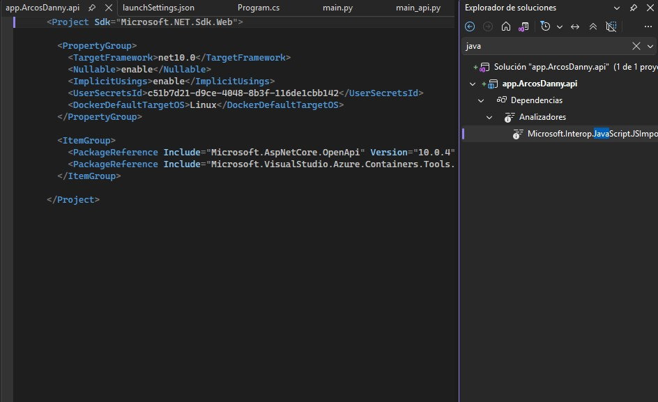
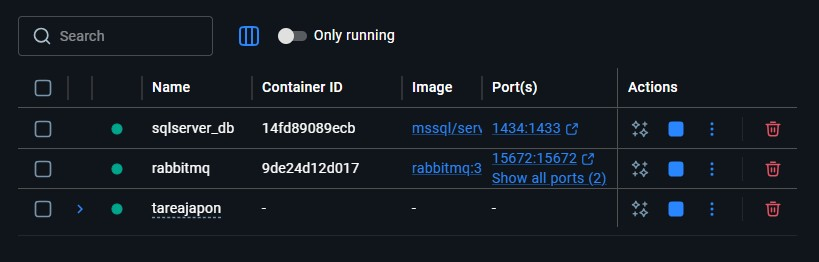
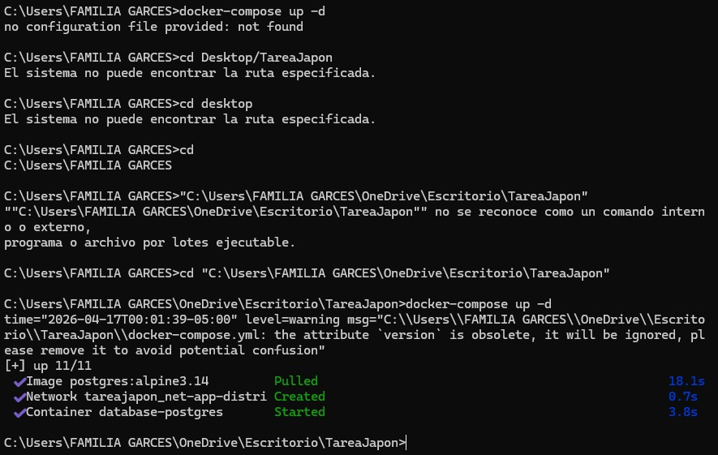
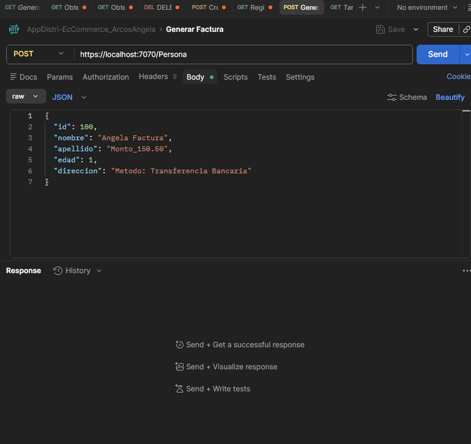
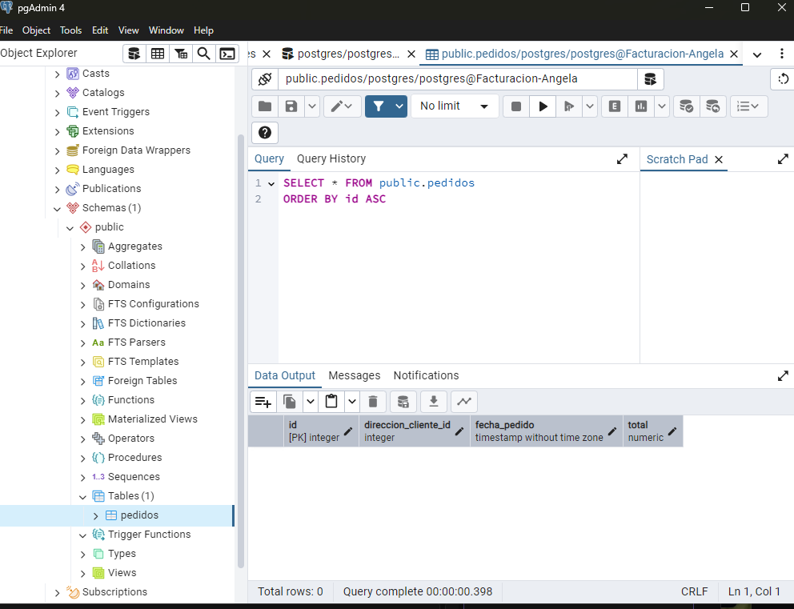

# Microservicio Subscriber - Facturación
**Estudiante:** Angela Daniela Arcos

## Descripción
Este microservicio es un **Subscriber** desarrollado en .NET. Su función principal es escuchar eventos de la cola de RabbitMQ y persistir la información de facturación en una base de datos PostgreSQL.

## Estructura del Proyecto
Configuración de la solución y dependencias del sistema en Visual Studio.

## Conexión a RabbitMQ
El servicio se conecta al broker de RabbitMQ. Se valida que los servicios de infraestructura estén activos mediante contenedores.

## Infraestructura y Base de Datos
Levantamiento de los servicios de PostgreSQL y red virtual mediante Docker Compose.

## Consumo y Pruebas (Postman)
Evidencia de la correcta recepción de mensajes y procesamiento de facturas.

## Estructura de la tabla Pedidos
Diseño de la tabla en pgAdmin para el almacenamiento permanente de los datos.

## Evidencias de Configuración
Capturas adicionales de la gestión de archivos y pruebas de autorización.

## Conclusión
Se integró exitosamente RabbitMQ con PostgreSQL en un entorno de microservicios, cumpliendo con los requerimientos de la tarea del Universitario Japón.
