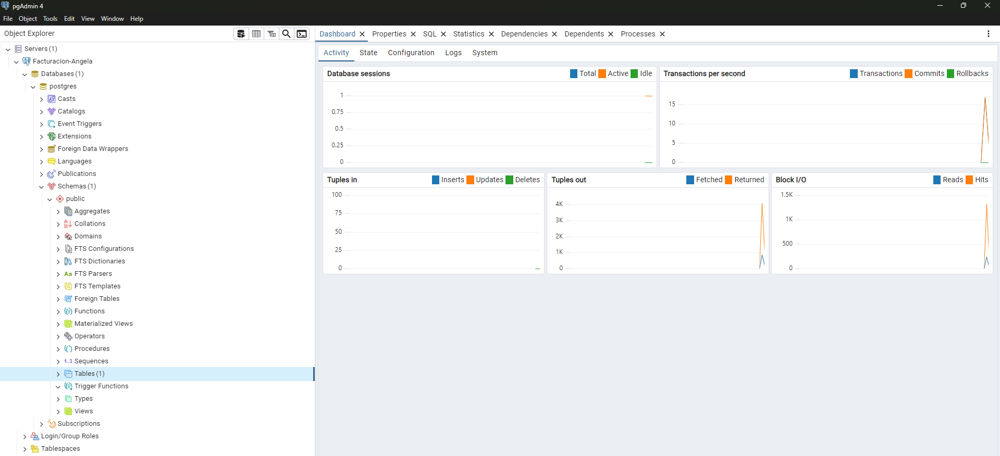

# Microservicio Subscriber - Facturación
**Estudiante:** Angela Daniela Arcos

## Descripción
Este microservicio es un **Subscriber** desarrollado en .NET 10. Su función principal es escuchar eventos de la cola de RabbitMQ y persistir la información de facturación en una base de datos PostgreSQL.

*Estructura de la solución en Visual Studio.*

## Conexión a RabbitMQ
El servicio se conecta al broker de RabbitMQ utilizando el puerto 5672. Se valida que los servicios de infraestructura estén activos mediante contenedores.

*Estado de los contenedores en Docker Desktop.*

## Consumo de la cola pedidoEvent
Se utiliza la librería `RabbitMQ.Client` para suscribirse a la cola `pedidoEvent`. El servicio queda en modo escucha (listening) para procesar cualquier mensaje entrante.

## Conexión a PostgreSQL
La persistencia se realiza en una base de datos PostgreSQL alojada en un contenedor. La infraestructura se levanta mediante Docker Compose.

*Comando docker-compose iniciando la base de datos.*

## Inserción de datos
El proceso se activa cuando el suscriptor recibe un JSON. Los datos son validados e insertados en la tabla correspondiente.

*Prueba de envío desde Postman con respuesta 201 Created.*

## Estructura de la tabla Pedidos
La tabla contiene los campos esenciales para el registro de ventas: `id`, `direccion_cliente_id`, `fecha_pedido` y `total`.

*Esquema de la tabla en pgAdmin 4.*

## Evidencias Finales
A continuación se muestran capturas adicionales del proceso de gestión y configuración del sistema.

*Guardado y configuración del archivo Program.cs.*

## Conclusión
El proyecto integra exitosamente tecnologías de mensajería (RabbitMQ) y bases de datos relacionales (PostgreSQL) bajo un entorno de contenedores. Se demostró la capacidad de respuesta del suscriptor ante peticiones externas y la correcta sincronización de la arquitectura.
